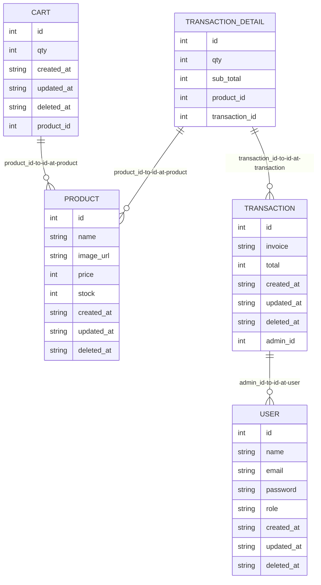

```mermaid
erDiagram
    USER {
        int id
        string name
        string email
        string password
        string role
        string created_at
        string updated_at
        string deleted_at
    }
    PRODUCT {
        int id
        string name
        string image_url
        int price
        int stock
        string created_at
        string updated_at
        string deleted_at
    }
    CART ||--O{ PRODUCT : product_id-to-id-at-product
    CART {
        int id
        int qty
        string created_at
        string updated_at
        string deleted_at
        int product_id
    }
    TRANSACTION ||--O{ USER : admin_id-to-id-at-user
    TRANSACTION {
        int id
        string invoice
        int total
        string created_at
        string updated_at
        string deleted_at
        int admin_id
    }
    TRANSACTION_DETAIL ||--O{ TRANSACTION : transaction_id-to-id-at-transaction
    TRANSACTION_DETAIL ||--O{ PRODUCT : product_id-to-id-at-product
    TRANSACTION_DETAIL {
        int id
        int qty
        int sub_total
        int product_id
        int transaction_id
    }
```
